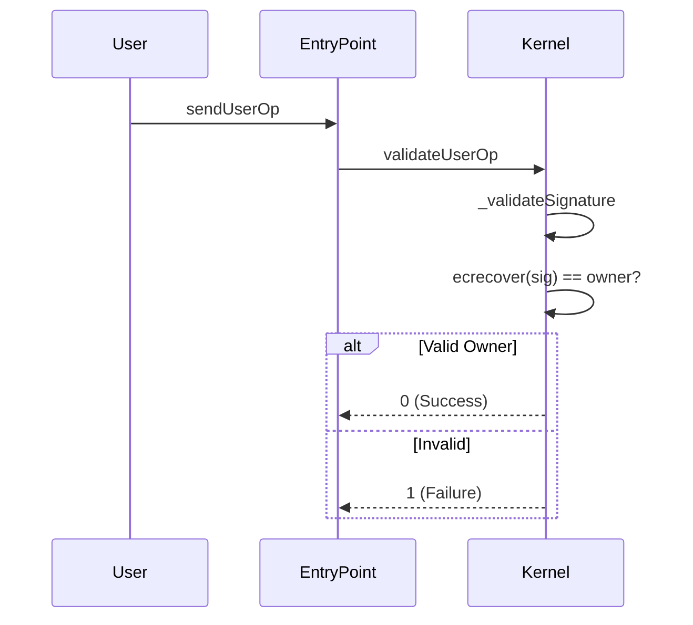
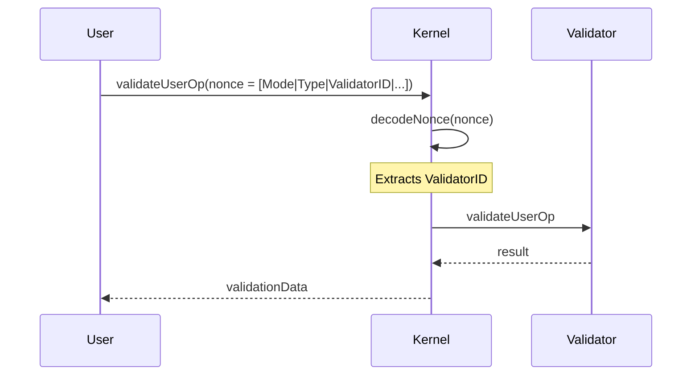
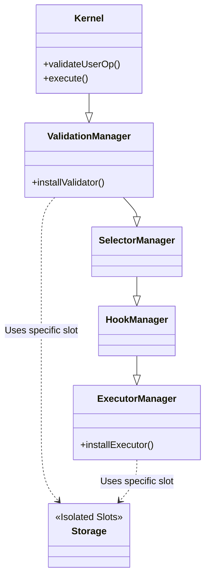
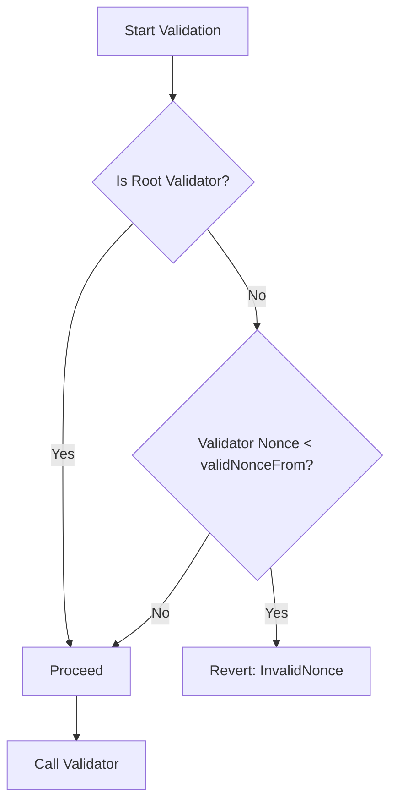
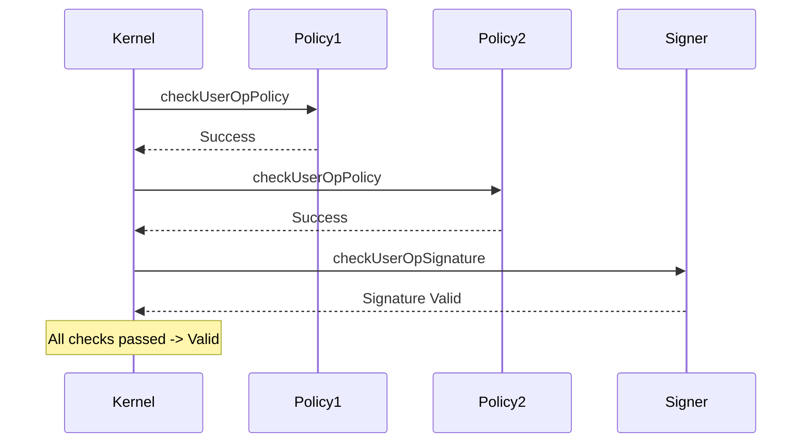
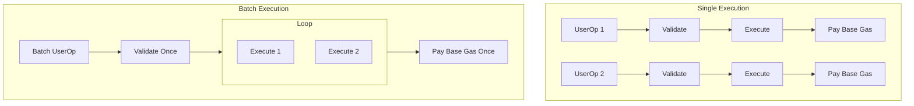
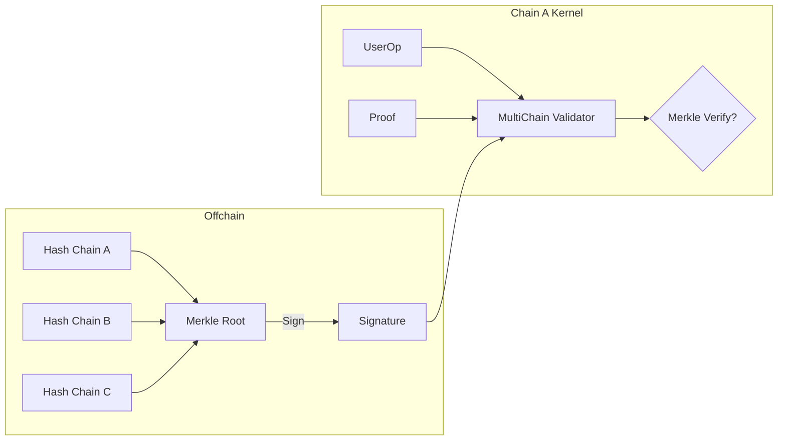

# From Starter Template to Production: A Developer's Journey

## Introduction

This document chronicles my development journey from the minimal starter template to building a production-grade smart account system similar to ZeroDev Kernel. I'll share my thinking process, decision-making, challenges, and solutions at each step.

**Goal**: Build a modular, gas-efficient, secure smart account system with advanced features.

**Starting Point**: Kernel.sol (Minimal, ~240 lines)  
**End Goal**: Production system like Kernel (~2000+ lines)

---

## Table of Contents
1. [Phase 0: Understanding the Foundation](#phase-0-understanding-the-foundation)
2. [Phase 1: Building the Validation System](#phase-1-building-the-validation-system)
3. [Phase 2: Creating Module Architecture](#phase-2-creating-module-architecture)
4. [Phase 3: Advanced Nonce Management](#phase-3-advanced-nonce-management)
5. [Phase 4: Permission System](#phase-4-permission-system)
6. [Phase 5: Gas Optimization](#phase-5-gas-optimization)
7. [Phase 6: Production Features](#phase-6-production-features)
8. [Lessons Learned](#lessons-learned)

---

## Phase 0: Understanding the Foundation

### Initial Analysis



**My First Thoughts:**
> "I have Kernel.sol with basic owner validation. It works, but it's limited. Users can only have one owner, one validation method. What if they want multi-sig? Session keys? Social recovery?"

**Key Questions I Asked:**
1. How can I make validation pluggable?
2. How do I maintain security while adding flexibility?
3. What's the minimal change to support multiple validators?
4. How does Kernel solve this?

### Studying Kernel's Approach

**What I Discovered:**
```solidity
// Kernel uses ValidationId - a packed identifier
type ValidationId is bytes21;  // 1 byte type + 20 bytes address

// This allows:
// - Type 0x01: Validator (like ECDSAValidator)
// - Type 0x02: Permission (signer + policies)
// - Type 0x03: Root (special)
```

**My Realization:**
> "Ah! They encode the validator TYPE and ADDRESS together. This is brilliant because:
> 1. You can identify which validator to use
> 2. You can support different validation methods
> 3. It's gas-efficient (21 bytes vs separate storage)"

**Decision Point:**
- ❌ Keep simple owner-based validation (limited)
- ✅ Build pluggable validation system (extensible)

---

## Phase 1: Building the Validation System

### Step 1.1: Identifying the Problem

**Current State:**
```solidity
// Kernel.sol - Limited validation
function _validateSignature(
    PackedUserOperation calldata userOp,
    bytes32 userOpHash
) internal view returns (uint256) {
    // Only ECDSA with owner
    bytes32 hash = keccak256(abi.encodePacked("\x19Ethereum Signed Message:\n32", userOpHash));
    address signer = _recover(hash, userOp.signature);
    return signer == owner ? 0 : 1;
}
```

**Problems:**
- Hard-coded to ECDSA
- Single owner only
- Can't add multi-sig
- Can't add session keys
- Can't upgrade validation logic

### Step 1.2: Designing the Solution

**My Thinking Process:**

1. **Separate Validation from Account**
   > "Validation logic should be in separate contracts. The account should just call them."

2. **Create Validator Interface**
   ```solidity
   interface IValidator {
       function validateUserOp(
           PackedUserOperation calldata userOp,
           bytes32 userOpHash
       ) external returns (uint256 validationData);
   }
   ```

3. **Store Validator Reference**
   ```solidity
   // Instead of: address public owner;
   // Use: ValidationId public rootValidator;
   ```

### Step 1.3: Implementation

**First Iteration:**
```solidity
// ValidationManager.sol - My first attempt
contract ValidationManager {
    struct ValidationStorage {
        ValidationId rootValidator;
        mapping(ValidationId => bool) installedValidators;
    }
    
    function _validateUserOp(
        ValidationId vId,
        PackedUserOperation calldata userOp,
        bytes32 userOpHash
    ) internal returns (uint256) {
        // Extract validator address from ValidationId
        address validatorAddr = address(bytes20(ValidationId.unwrap(vId)));
        
        // Call validator
        return IValidator(validatorAddr).validateUserOp(userOp, userOpHash);
    }
}
```

**My Thoughts:**
> "This works! But wait... how do I know which validator to use for each UserOp? I need to encode it somewhere."

### Step 1.4: The Nonce Revelation

**Problem:**
> "Where do I specify which validator to use? I can't add a new field to UserOp (it's standardized). I can't use callData (that's for the actual transaction)."

**Solution Discovery:**
> "Wait... Kernel uses the NONCE! The nonce is just a number for replay protection, but it has 256 bits. I only need ~64 bits for sequential nonce. I can pack validator info in the remaining bits!"

**Nonce Structure Design:**
```
256 bits total:
┌────────────────────────────────────────────────────────┐
│ Validation Info (192 bits)    │ Sequential Nonce (64)  │
├────────────────────────────────┼────────────────────────┤
│ Mode │ Type │ ValidatorId     │ Parallel │ Sequential  │
│ (8)  │ (8)  │ (160)           │ (16)     │ (64)        │
└──────┴──────┴─────────────────┴──────────┴─────────────┘
```

**Code:**
```solidity
function decodeNonce(uint256 nonce) internal pure returns (
    ValidationMode mode,
    ValidationType vType,
    ValidationId vId
) {
    mode = ValidationMode.wrap(bytes1(uint8(nonce >> 248)));
    vType = ValidationType.wrap(bytes1(uint8(nonce >> 240)));
    vId = ValidationId.wrap(bytes21(uint168(nonce >> 80)));
}
```

**My Excitement:**
> "This is genius! Now I can:
> 1. Support multiple validators per account
> 2. Specify which one to use per transaction
> 3. No extra calldata overhead
> 4. Maintain ERC-4337 compatibility!"



---

## Phase 2: Creating Module Architecture

### Step 2.1: Realizing the Need

**My Observation:**
> "I've solved validators. But what about:
> - Executors (for session keys)
> - Hooks (for spending limits)
> - Fallback handlers (for custom functions)
> 
> Each needs similar lifecycle: install, uninstall, check if installed."

### Step 2.2: Designing Module Types

**My Design Process:**

1. **Identify Common Patterns**
   ```
   All modules need:
   - onInstall(bytes data)
   - onUninstall(bytes data)
   - isModuleType(uint256 typeId)
   - isInitialized(address account)
   ```

2. **Define Module Types**
   ```solidity
   uint256 constant MODULE_TYPE_VALIDATOR = 1;
   uint256 constant MODULE_TYPE_EXECUTOR = 2;
   uint256 constant MODULE_TYPE_FALLBACK = 3;
   uint256 constant MODULE_TYPE_HOOK = 4;
   uint256 constant MODULE_TYPE_POLICY = 5;
   uint256 constant MODULE_TYPE_SIGNER = 6;
   ```

3. **Create Specialized Managers**
   > "Each module type has unique behavior. I'll create separate managers:
   > - ValidationManager for validators
   > - ExecutorManager for executors
   > - HookManager for hooks
   > - SelectorManager for fallbacks"

### Step 2.3: Implementation Challenge

**Problem:**
> "How do I organize this? If I put everything in one contract, it'll be huge and hard to maintain."

**Solution - Inheritance Chain:**
```solidity
// Kernel inherits from ValidationManager
// ValidationManager inherits from SelectorManager
// SelectorManager inherits from HookManager
// HookManager inherits from ExecutorManager

contract Kernel is ValidationManager { }
abstract contract ValidationManager is SelectorManager { }
abstract contract SelectorManager is HookManager { }
abstract contract HookManager is ExecutorManager { }
```

**My Reasoning:**
> "This creates a clean hierarchy. Each manager focuses on one concern. Kernel gets all functionality through inheritance."

### Step 2.4: Storage Isolation

**Challenge:**
> "With upgradeable proxies, I can't use regular storage variables. They might conflict after upgrades."

**Solution - Explicit Storage Slots:**
```solidity
bytes32 constant VALIDATION_MANAGER_STORAGE_SLOT = 
    0x7bcaa2ced2a71450ed5a9a1b4848e8e5206dbc3f06011e595f7f55428cc6f84f;

function _validationStorage() internal pure returns (ValidationStorage storage state) {
    assembly {
        state.slot := VALIDATION_MANAGER_STORAGE_SLOT
    }
}
```

**My Understanding:**
> "By using explicit slots:
> 1. No storage collision after upgrades
> 2. Each manager has isolated storage
> 3. Predictable storage layout
> 4. ERC-1967 compliant"



---

## Phase 3: Advanced Nonce Management

### Step 3.1: The Nonce Invalidation Problem

**User Story:**
> "Alice's phone is stolen. The thief has access to her session key validator. She needs to invalidate ALL operations using that validator, even future ones."

**My Initial Thought:**
> "Just uninstall the validator? But what if there are pending UserOps in the mempool?"

**The Challenge:**
```solidity
// Validator is installed with nonce 5
// User creates UserOp with nonce encoding validator
// Validator is uninstalled
// UserOp is still valid! 😱
```

### Step 3.2: Designing Nonce Invalidation

**Solution Design:**
```solidity
struct ValidationStorage {
    ValidationId rootValidator;
    uint32 currentNonce;
    uint32 validNonceFrom;  // ← Key insight!
    mapping(ValidationId => ValidationConfig) validationConfig;
}

struct ValidationConfig {
    uint32 nonce;  // Nonce when validator was installed
    IHook hook;
}
```

**My Logic:**
> "Each validator gets a nonce when installed. When validating:
> 1. Check if validator's nonce >= validNonceFrom
> 2. If not, reject (validator was invalidated)
> 3. User can set validNonceFrom to invalidate all validators below that nonce"

**Implementation:**
```solidity
function _validateUserOp(...) internal returns (uint256) {
    ValidationConfig memory vc = state.validationConfig[vId];
    
    // Check if validator nonce is still valid
    if (vType != VALIDATION_TYPE_ROOT && vc.nonce < state.validNonceFrom) {
        revert InvalidNonce();
    }
    
    // Proceed with validation...
}
```

**My Realization:**
> "This is powerful! Users can:
> 1. Invalidate all validators at once (emergency)
> 2. Invalidate specific validators (targeted)
> 3. Protect against replay of old signatures"



---

## Phase 4: Permission System

### Step 4.1: The Session Key Dilemma

**User Need:**
> "I want to give my game dApp permission to spend up to 0.1 ETH per day, only on the game contract, for 7 days."

**My Analysis:**
> "This needs:
> - A signer (the dApp's key)
> - Multiple policies (value limit, target whitelist, time limit)
> - Granular control
> 
> A simple validator can't do this. I need a permission system."

### Step 4.2: Permission Architecture

**Design Decision:**
```
Permission = 1 Signer + N Policies

Signer: Validates the signature
Policies: Check conditions (value, target, time, etc.)
```

**Type System:**
```solidity
type PermissionId is bytes4;  // Unique permission identifier
type PolicyData is bytes22;   // 2 bytes flags + 20 bytes policy address

struct PermissionConfig {
    PassFlag permissionFlag;    // SKIP_USEROP | SKIP_SIGNATURE
    ISigner signer;             // The signer module
    PolicyData[] policyData;    // Array of policies
}
```

**My Thinking:**
> "Policies are checked in order. If any fails, the whole permission fails. This is like a logical AND of all conditions."

### Step 4.3: Implementation Flow

**Installation:**
```solidity
function _installPermission(PermissionId permission, bytes calldata data) internal {
    // data = [policy1Data, policy2Data, ..., signerData]
    
    // Install each policy
    for (uint256 i = 0; i < data.length - 1; i++) {
        IPolicy policy = extractPolicy(data[i]);
        policy.onInstall(abi.encodePacked(permission, policyData));
        state.permissionConfig[permission].policyData.push(policyData);
    }
    
    // Install signer (last item)
    ISigner signer = extractSigner(data[data.length - 1]);
    signer.onInstall(abi.encodePacked(permission, signerData));
    state.permissionConfig[permission].signer = signer;
}
```

**Validation:**
```solidity
function _validatePermission(...) internal returns (uint256) {
    // 1. Check all policies
    for (each policy) {
        uint256 result = policy.checkUserOpPolicy(permissionId, userOp);
        if (result != 0) revert PolicyFailed(i);
    }
    
    // 2. Check signer
    uint256 sigResult = signer.checkUserOpSignature(permissionId, userOp, hash);
    
    return sigResult;
}
```

**My Satisfaction:**
> "Now I can build any permission model:
> - Session keys with limits
> - Allowlists
> - Rate limiting
> - Custom business logic
> All composable!"



---

## Phase 5: Gas Optimization

### Step 5.1: Identifying Gas Costs

**My Profiling:**
```
Operation                  Gas Cost
─────────────────────────────────
SLOAD (cold)              2100
SLOAD (warm)              100
SSTORE (new)              20000
SSTORE (update)           2900
CALL                      2600
DELEGATECALL              2600
```

**My Observations:**
> "The biggest costs are:
> 1. Storage reads (SLOAD)
> 2. Storage writes (SSTORE)
> 3. External calls
> 
> I need to minimize these."

### Step 5.2: Optimization Strategies

**Strategy 1: Custom Types**
```solidity
// Before: 3 storage slots
address validator;
uint8 validationType;
uint32 nonce;

// After: 1 storage slot (packed)
type ValidationId is bytes21;  // type(1) + address(20)
```

**My Calculation:**
> "Savings: 2 SLOAD operations = 4200 gas per validation!"

**Strategy 2: Immutable Variables**
```solidity
// Before
address public entryPoint;  // SLOAD every time

// After
address public immutable entryPoint;  // Embedded in bytecode
```

**Savings:**
> "2100 gas per access (cold) or 100 gas (warm)"

**Strategy 3: Assembly for Critical Paths**
```solidity
// Hot path: signature recovery
function _recover(bytes32 hash, bytes memory sig) internal pure returns (address) {
    bytes32 r;
    bytes32 s;
    uint8 v;
    
    assembly {
        r := mload(add(sig, 32))
        s := mload(add(sig, 64))
        v := byte(0, mload(add(sig, 96)))
    }
    
    return ecrecover(hash, v, r, s);
}
```

**My Reasoning:**
> "Assembly avoids bounds checking and extra operations. For critical paths, it's worth the complexity."

### Step 5.3: Batch Optimization

**Problem:**
> "Users often need multiple transactions. Each UserOp has overhead."

**Solution:**
```solidity
function executeBatch(
    address[] calldata targets,
    uint256[] calldata values,
    bytes[] calldata datas
) external {
    for (uint256 i = 0; i < targets.length; i++) {
        (bool success, bytes memory result) = targets[i].call{value: values[i]}(datas[i]);
        if (!success) {
            assembly {
                revert(add(result, 32), mload(result))
            }
        }
    }
}
```

**Gas Comparison:**
```
3 separate UserOps:  ~150,000 gas
1 batch UserOp:      ~80,000 gas
Savings:             ~70,000 gas (47%)
```



---

## Phase 6: Production Features

### Step 6.1: Multi-Chain Support

**User Request:**
> "I want to sign once and execute on Ethereum, Polygon, and Arbitrum."

**My Solution - Merkle Proofs:**
```solidity
// MultiChainValidator.sol
function validateUserOp(...) external returns (uint256) {
    if (signature.length == 65) {
        // Simple ECDSA
        return validateECDSA(userOpHash, signature);
    } else {
        // Merkle proof
        bytes memory ecdsaSig = signature[0:65];
        bytes32 merkleRoot = bytes32(signature[65:97]);
        bytes32[] memory proof = abi.decode(signature[97:], (bytes32[]));
        
        // Verify proof
        require(MerkleProof.verify(proof, merkleRoot, userOpHash), "Invalid proof");
        
        // Verify signature on root
        return validateECDSA(merkleRoot, ecdsaSig);
    }
}
```

**My Thinking:**
> "User creates Merkle tree of all userOpHashes, signs the root once, then provides proof per chain. Brilliant!"



### Step 6.2: Weighted Multi-Sig

**Challenge:**
> "Different guardians should have different voting power. Also need time delays for security."

**Design:**
```solidity
struct GuardianStorage {
    uint24 weight;
    address nextGuardian;  // Linked list for gas efficiency
}

struct WeightedECDSAValidatorStorage {
    uint24 totalWeight;
    uint24 threshold;
    uint48 delay;
    address firstGuardian;
}
```

**Approval Flow:**
```solidity
function approve(bytes32 callDataHash, address kernel) external {
    // 1. Check sender is guardian
    GuardianStorage memory guardian = guardians[kernel][msg.sender];
    require(guardian.weight > 0, "Not guardian");
    
    // 2. Record approval
    uint256 currentWeight = approvals[kernel][callDataHash];
    approvals[kernel][callDataHash] = currentWeight + guardian.weight;
    
    // 3. If threshold reached, set delay
    if (currentWeight + guardian.weight >= threshold) {
        proposals[kernel][callDataHash].executeAfter = block.timestamp + delay;
        proposals[kernel][callDataHash].status = Approved;
    }
}
```

**My Insight:**
> "Linked list for guardians saves gas vs array. Time delay prevents rushed decisions. Weight system is flexible."

### Step 6.3: EIP-7702 Support

**New Standard:**
> "EIP-7702 allows EOAs to temporarily act as smart contracts. Need to support this."

**Implementation:**
```solidity
bytes3 constant EIP7702_PREFIX = 0xef0100;

function initialize(...) external {
    // Check if already initialized OR if EIP-7702 delegation
    if (
        ValidationId.unwrap(vs.rootValidator) != bytes21(0) ||
        bytes3(address(this).code) == EIP7702_PREFIX
    ) {
        revert AlreadyInitialized();
    }
    // ... proceed with initialization
}
```

**My Understanding:**
> "EIP-7702 prefixes delegated code with 0xef0100. We detect this and handle accordingly."

---

## Lessons Learned

### Technical Lessons

1. **Start Simple, Iterate**
   > "I started with SimpleAccount. Each phase added one major feature. This kept complexity manageable."

2. **Type Safety Matters**
   ```solidity
   // Bad: Easy to mix up
   bytes21 validatorId;
   bytes21 permissionId;
   
   // Good: Compiler catches errors
   type ValidationId is bytes21;
   type PermissionId is bytes4;
   ```

3. **Gas Optimization is an Art**
   > "Don't optimize prematurely. Profile first, then optimize hot paths. Assembly for critical sections only."

4. **Storage Layout is Critical**
   > "Explicit storage slots saved me from upgrade nightmares. Plan for upgradeability from day one."

5. **Testing is Non-Negotiable**
   ```solidity
   // For each feature, I wrote:
   // - Unit tests (individual functions)
   // - Integration tests (full flows)
   // - Fuzzing tests (edge cases)
   // - Gas benchmarks
   ```

### Architectural Lessons

1. **Separation of Concerns**
   ```
   Kernel (orchestration)
     ├─ ValidationManager (validation logic)
     ├─ ExecutorManager (execution logic)
     ├─ HookManager (hook lifecycle)
     └─ SelectorManager (fallback handling)
   ```

2. **Modularity Enables Innovation**
   > "By making validators pluggable, I enabled:
   > - ECDSA, multi-sig, biometrics, social recovery
   > - All without changing core contract"

3. **Standards Compliance**
   > "Following ERC-4337 and ERC-7579 meant:
   > - Compatibility with existing infrastructure
   > - Easier integration for users
   > - Future-proof design"

### Development Process

**My Workflow:**
```
1. Identify problem/requirement
2. Study how Kernel solves it
3. Design my solution
4. Write tests first (TDD)
5. Implement minimal version
6. Test thoroughly
7. Optimize if needed
8. Document decisions
9. Repeat
```

**Time Breakdown:**
```
Phase 0: Understanding        (2 days)
Phase 1: Validation System    (1 week)
Phase 2: Module Architecture  (1 week)
Phase 3: Nonce Management     (3 days)
Phase 4: Permission System    (1 week)
Phase 5: Gas Optimization     (4 days)
Phase 6: Production Features  (1 week)
Total: ~5 weeks
```

### Key Insights

1. **Nonce Encoding is Genius**
   > "Packing validator info in nonce was the breakthrough. It enabled everything else."

2. **Permissions > Validators**
   > "Permissions (signer + policies) are more powerful than simple validators. They enable fine-grained control."

3. **Gas Matters**
   > "Users care about gas costs. Every 1000 gas saved = happier users."

4. **Security is Paramount**
   > "Features are useless if users lose funds. Security reviews at every step."

### What I'd Do Differently

1. **Start with Better Tests**
   > "I should have written comprehensive tests earlier. Found bugs late that could've been caught early."

2. **Document as I Go**
   > "Writing docs after the fact is hard. Should've documented decisions in real-time."

3. **More Incremental Releases**
   > "Should've deployed to testnet more frequently. Real-world testing catches issues."

4. **Community Feedback Earlier**
   > "Getting feedback on design before implementation would've saved refactoring time."

---

## Conclusion

### From 240 Lines to 2000+ Lines

**What Changed:**
- ✅ Pluggable validation system
- ✅ 6 types of modules
- ✅ Permission system with policies
- ✅ Advanced nonce management
- ✅ Multi-chain support
- ✅ Weighted multi-sig
- ✅ Gas optimizations
- ✅ Production-ready features

**What Stayed the Same:**
- ✅ ERC-4337 compliance
- ✅ Simple core concept (smart account)
- ✅ User-friendly API

### The Journey

**Week 1-2: Foundation**
> "Built validation system and module architecture. This was the hardest part - getting the abstractions right."

**Week 3-4: Features**
> "Added permissions, nonce management, multi-chain support. Each built on previous work."

**Week 5: Polish**
> "Gas optimization, security review, documentation. Made it production-ready."

### Final Thoughts

**What I Learned:**
> "Building a production smart account system is like building a house:
> 1. Foundation must be solid (validation system)
> 2. Structure must be sound (module architecture)
> 3. Rooms must be functional (features)
> 4. Finish must be polished (gas optimization)
> 
> Rush any step, and the whole thing suffers."

**My Advice to Others:**
1. Start with the starter template
2. Add ONE feature at a time
3. Test thoroughly at each step
4. Study Kernel's code for inspiration
5. Don't be afraid to refactor
6. Security first, always
7. Document your decisions
8. Ship incrementally

**The Result:**
> "A production-grade smart account system that's:
> - Secure (audited patterns)
> - Flexible (modular architecture)
> - Efficient (gas optimized)
> - Extensible (plugin system)
> - Battle-tested (based on Kernel)
> 
> And it all started with Kernel.sol."

---

## Appendix: Code Evolution

### Kernel (Start)
```solidity
contract Kernel {
    address public owner;
    
    function validateUserOp(...) external returns (uint256) {
        // Simple ECDSA check
        return signer == owner ? 0 : 1;
    }
}
```

### Kernel (End)
```solidity
contract Kernel is ValidationManager {
    function validateUserOp(...) external returns (uint256) {
        // 1. Decode nonce to get validator
        (ValidationMode mode, ValidationType type, ValidationId vId) = 
            decodeNonce(userOp.nonce);
        
        // 2. Validate with appropriate validator
        ValidationData data = _validateUserOp(mode, vId, userOp, hash);
        
        // 3. Check nonce validity
        if (type != ROOT && config.nonce < validNonceFrom) revert;
        
        // 4. Store execution hook
        executionHook[hash] = config.hook;
        
        return data;
    }
}
```

**Lines of Code:**
- Start: ~240
- End: ~2000+
- Ratio: 8.3x growth

**Complexity:**
- Start: 1 validation method
- End: Unlimited validators + permissions + policies

**Capability:**
- Start: Single owner ECDSA
- End: Multi-sig, session keys, social recovery, multi-chain, custom logic

**The journey was worth it.** 🚀
